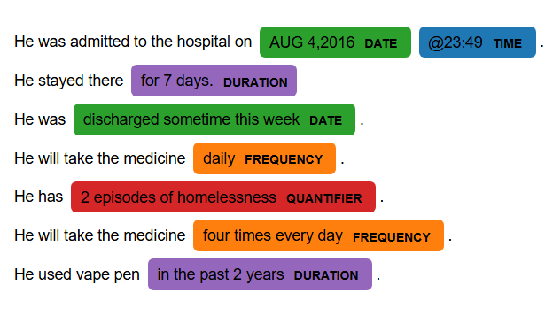

# Temporal Entity Extractor

This package implements temporal entity extraction for spaCy/medspaCy styled documents. It is compatible with spaCy-styled tokenizer. This package contains two steps:

1. `token tagging`: label tokens according to the concept rules
2. `entity extraction`: label temporal entities based on the token labels.

## Examples

### 1. Token tagging with concept rules

```
import medspacy
import spacy
from medspacy.ner import TargetRule
from medspacy.ner import ConceptTagger
from spacy.tokens import Span

import temporal_token_rules

nlp = medspacy.load(medspacy_enable=["medspacy_pyrush"]) #sentenciser
concept_matcher = nlp.add_pipe("medspacy_concept_tagger")
tagger_rules = temporal_token_rules.get_token_rules()
concept_matcher.add(tagger_rules) 

doc_token_tagger = nlp("for the past 2 weeks")
for token in doc_token_tagger:
    print(token, token._.concept_tag)
    
>>> 
for 
the DETERMINER
past PAST
2 
weeks WEEK
```

### 2. Temporal entity extraction based on token

```
import temporal_NER_rules
if "medspacy_target_matcher" in nlp.pipe_names:
    nlp.remove_pipe("medspacy_target_matcher")
target_matcher = nlp.add_pipe("medspacy_target_matcher")
ner_rules = temporal_NER_rules.get_NER_rules()
target_matcher.add(ner_rules)
doc = nlp(test_string)
visualize_ent(doc)
```




## Publication

This work has been submitted to AMIA 2025 poster session: "Streamlining Temporal Information Extraction: Integrating Rule-Based Methods into MedspaCy for Clinical Application, Mengke Hu, Alec B. Chapman, Patrick R. Alba, Jianlin Shi"
